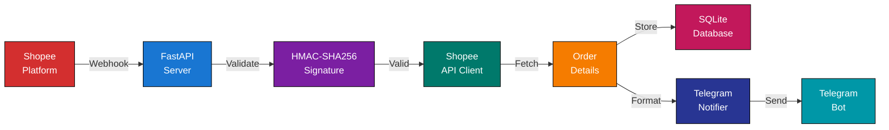
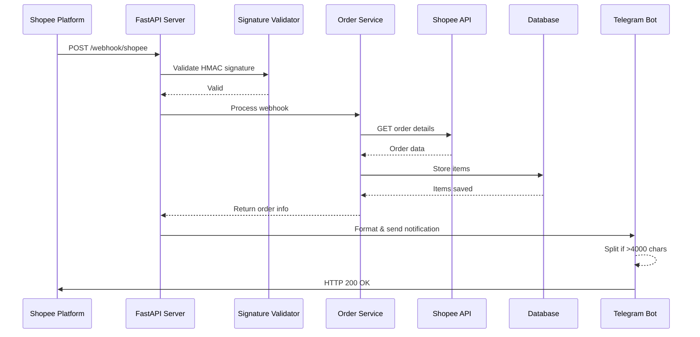
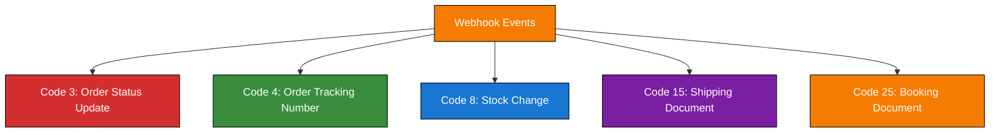
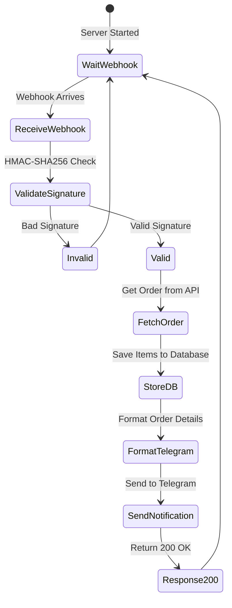

# Shopee Webhook Receiver

Real-time order processing system for Shopee e-commerce platform with Telegram notifications.

[](https://www.python.org/downloads/)
[](https://www.docker.com/)
[](LICENSE)

## Features

- **Real-time Notifications** - Instantly receive Shopee order updates via Telegram
- **Secure Webhooks** - HMAC-SHA256 signature validation for all incoming events
- **Complete Order Data** - Automatic API fetch for comprehensive order details
- **Persistent Storage** - SQLite database for order tracking and history
- **Auto Token Refresh** - Seamless handling of Shopee API token expiration
- **Smart Messaging** - Intelligent message splitting for large orders (>4000 chars)
- **Health Monitoring** - Built-in health checks for orchestration systems
- **Organized Logs** - Date and session-based logging with Singapore timezone

## Architecture



## Webhook Processing Flow



## Quick Start

### Prerequisites

- Docker & Docker Compose (recommended)
- Or Python 3.11+ with pip

**Required Credentials:**
- Shopee Partner ID, Key, Shop ID
- Shopee Access & Refresh Tokens
- Telegram Bot Token & Chat ID

### Setup

#### 1. Clone Repository
```bash
git clone https://github.com/yourusername/shopee-webhook.git
cd shopee-webhook
```

#### 2. Configure Credentials
```bash
cp .env.example .env
# Edit .env with your credentials
nano .env
```

#### 3. Run with Docker
```bash
docker-compose up -d
```

Server runs on `http://localhost:8000`

#### Or Run Locally
```bash
pip install -r requirements.txt
python -m uvicorn shopee_webhook.main:app --host 0.0.0.0 --port 8000
```

## Configuration

### Environment Variables

| Variable | Required | Description | Example |
|----------|----------|-------------|---------|
| `PARTNER_ID` | Yes | Shopee Partner ID | `2011563` |
| `PARTNER_KEY` | Yes | Partner Key (for signing) | `abc123def456` |
| `SHOP_ID` | Yes | Your Shop ID | `443972786` |
| `ACCESS_TOKEN` | Yes | Shopee API Access Token | `eyJhbGc...` |
| `REFRESH_TOKEN` | Yes | Shopee API Refresh Token | `eyJhbGc...` |
| `WEBHOOK_PARTNER_KEY` | Yes | Webhook validation key | `webhook_key_xyz` |
| `TELEGRAM_BOT_TOKEN` | Yes | Telegram Bot Token | `123456:ABC-DEF` |
| `TELEGRAM_CHAT_ID` | Yes | Telegram Channel/Chat ID | `-1001234567890` |
| `LOG_LEVEL` | No | Logging level | `INFO` (default) |

### Auto-Generated Files

These are created automatically on first run:

```
config/
  ├── shopee_tokens.json        # Cached tokens with expiration
  └── telegram_topics.json      # Event code → Topic ID mappings
```

## API Endpoints

### POST `/webhook/shopee`
Receives webhook events from Shopee platform.

**Headers:**
```
X-Shopee-Signature: <HMAC-SHA256 signature>
Content-Type: application/json
```

**Response:** `200 OK` (empty body as required by Shopee)

---

### GET `/health`
Health check endpoint for monitoring.

**Response:**
```json
{
  "status": "healthy|degraded",
  "service": "shopee-webhook-receiver",
  "checks": {
    "database": "ok|error: ...",
    "config": {
      "tokens_file": "ok|missing",
      "topics_file": "ok|not_created_yet"
    },
    "environment": {
      "partner_id": "ok|missing",
      "shop_id": "ok|missing"
    }
  }
}
```

## Supported Webhook Events



## Telegram Message Format

Messages are automatically split into two clear sections:

### Section 1: Webhook Event
What Shopee called back:
- Event code and name
- Shop ID and timestamp
- Event data (ordersn, status, update_time, etc.)

### Section 2: Order Details
Complete order information from API:
- **Order Info**: ID, status, created/updated times
- **Buyer**: Username and contact info
- **Shipping**: Address details (if available)
- **Financial**: Amount, currency, payment method
- **Shipping Carrier**: Logistics provider
- **Items**: All items with SKUs, variations, quantities

### Message Splitting
If the message exceeds 4000 characters:
- Automatically splits into multiple parts
- Each part is sent sequentially to same Telegram topic
- Preserves formatting and readability

## Database Schema

Orders are stored with 12 columns per item:

| Column | Type | Description |
|--------|------|-------------|
| `order_id` | String | Shopee order SN |
| `date_time` | DateTime | Order creation time (Singapore TZ) |
| `buyer` | String | Buyer username |
| `platform` | String | "Shopee" |
| `product_name` | String | Item name |
| `item_type` | String | Variation/model name |
| `parent_sku` | String | Item's base SKU |
| `sku` | String | Model SKU |
| `quantity` | Int | Quantity purchased |
| `total_sale` | Float | Order total amount |
| `shopee_status` | String | Shopee order status |
| `status` | String | Order status |

**Location:** `data/shopee_orders.db` (auto-created, gitignored)

## Logging

### Log Structure

Logs are organized by date and session:
```
logs/
  webhook_2026-01-04_2fced767.log  # Date + Session ID
  webhook_2026-01-05_a8d7e9f2.log
  webhook_2026-01-05_9b3c1e5d.log  # Multiple sessions same day
```

### Log Format

All logs are structured JSON for easy parsing:
```json
{
  "timestamp": "2026-01-04T03:11:39.464868+08:00",
  "level": "INFO",
  "logger": "shopee_webhook.services.order_service",
  "message": "Stored 4 items for order 2601033YS140TT in database"
}
```

### Timezone

Logs use Singapore timezone (UTC+8) to match local time.

### View Logs

```bash
# Real-time Docker logs
docker-compose logs -f webhook-server

# View specific log file
cat logs/webhook_2026-01-04_*.log | python -m json.tool

# Pretty print JSON logs
cat logs/*.log | jq '.'
```

## Testing

### Manual Webhook Test

```bash
python test_order_webhook.py
```

This sends a test webhook to `http://localhost:8000/webhook/shopee` and displays the response.

### Health Check

```bash
curl http://localhost:8000/health | python -m json.tool
```

### View Database

```bash
sqlite3 data/shopee_orders.db "SELECT * FROM order_items LIMIT 5;"
```

## Troubleshooting

### Webhook Signature Validation Fails

**Issue**: Signature mismatch errors

**Solution**:
1. Verify `WEBHOOK_PARTNER_KEY` matches Shopee console
2. Ensure raw webhook body is not modified
3. Check webhook is HMAC-SHA256 encoded

### API Returns 403 Forbidden

**Issue**: Token validation failed or invalid access_token

**Solution**:
1. App auto-refreshes tokens - wait a moment
2. Verify `ACCESS_TOKEN` and `REFRESH_TOKEN` are valid
3. Check `PARTNER_ID`, `PARTNER_KEY`, `SHOP_ID` are correct
4. Ensure tokens haven't expired on Shopee console

### No Telegram Messages Received

**Issue**: No notifications in Telegram

**Solution**:
1. Verify `TELEGRAM_BOT_TOKEN` format: `123456:ABC-DEF...`
2. Check `TELEGRAM_CHAT_ID` is valid (e.g., `-1001234567890`)
3. Ensure bot has permission to post in the channel
4. Check health endpoint: `curl http://localhost:8000/health`

### Database Lock/Connection Errors

**Issue**: Database is locked or operational error

**Solution**:
1. Delete `data/shopee_orders.db` (will recreate on restart)
2. Restart container: `docker-compose restart`
3. Check file permissions in `data/` directory

## Deployment

### Docker Production

```bash
# Build and run
docker-compose up -d

# View logs
docker-compose logs -f webhook-server

# Stop
docker-compose down
```

### Health Monitoring

Container includes automated health checks:
- **Interval**: Every 30 seconds
- **Timeout**: 3 seconds
- **Startup grace period**: 5 seconds
- **Retries**: 3 failures before unhealthy

Check status:
```bash
docker-compose ps
# Healthy: "Up X seconds (healthy)"
# Unhealthy: "Up X seconds (unhealthy)"
```

### Graceful Shutdown

- Waits for all pending tasks to complete
- Closes database connections cleanly
- No data loss during restart

## Environment Example

```bash
# Shopee API Credentials
PARTNER_ID=2011563
PARTNER_KEY=your_partner_key_here
SHOP_ID=443972786
ACCESS_TOKEN=your_access_token_here
REFRESH_TOKEN=your_refresh_token_here

# Webhook Security
WEBHOOK_PARTNER_KEY=your_webhook_key_here

# Telegram Bot
TELEGRAM_BOT_TOKEN=123456789:ABCDefGHIjklmnoPQRstuvWXYz
TELEGRAM_CHAT_ID=-1001234567890

# Optional
LOG_LEVEL=INFO
RELOAD=false
```

## How It Works



## License

This project is licensed under the MIT License - see the [LICENSE](LICENSE) file for details.

## Support

For issues or questions:
1. Check the health endpoint: `GET /health`
2. Review Docker logs: `docker-compose logs webhook-server`
3. View log files: `logs/webhook_*.log`
4. See Troubleshooting section above
