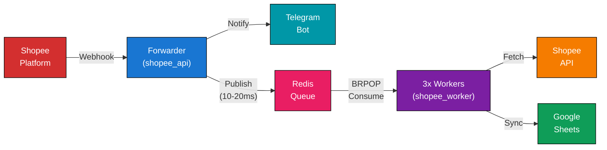
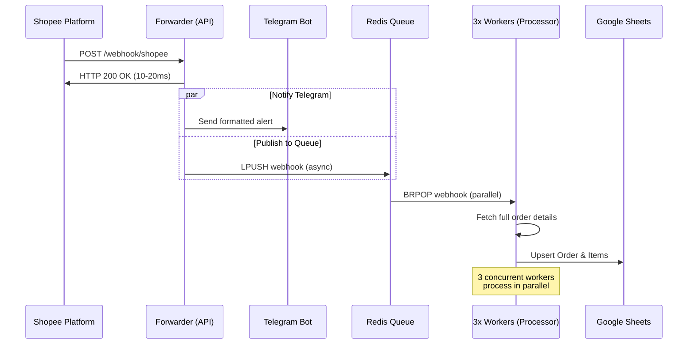

# Shopee Webhook Integration

A production-ready Shopee Open Platform webhook integration system. This project handles high-volume webhook events from Shopee, processes them asynchronously, sends real-time notifications to Telegram, and synchronizes order data to Google Sheets.

[](https://www.python.org/downloads/)
[](https://www.docker.com/)
[](LICENSE)

## Features

- **Redis Message Queue** - Asynchronous webhook processing with persistent Redis queue (AOF).
- **Parallel Processing** - 3 concurrent workers for high-throughput order processing.
- **Circuit Breaker** - Automatic fallback from Redis to HTTP when issues occur.
- **Split Architecture** - Decoupled Forwarder (`shopee_api`) and Worker (`shopee_worker`) services for high reliability.
- **Complete Order Data** - Automatic API fetch for comprehensive order details (Income, Escrow, Items).
- **Google Sheets Sync** - Automatically upserts order data into Google Sheets with financial breakdown.
- **Real-time Notifications** - Optional Telegram notifications for order updates.
- **Auto Token Refresh** - Seamless handling of Shopee API token expiration.
- **Smart Messaging** - Intelligent message splitting for large orders (>4000 chars).
- **Health Monitoring** - Built-in health checks and monitoring endpoints for queue/workers.
- **Topic-Based Alerts** - Automatically creates Telegram Forum Topics for different event types.
- **Dashboard** - Web dashboard for monitoring webhooks and configuration.

## Architecture

The system is split into three microservices with asynchronous message queue:

1.  **Forwarder (`shopee_api`)**: Receives webhooks, validates signatures, publishes to Redis queue, and handles Telegram notifications.
2.  **Redis Queue**: Persistent message queue with AOF durability and circuit breaker fallback.
3.  **Worker (`shopee_worker`)**: 3 parallel background processors that consume from Redis queue and handle heavy logic (API fetch, Google Sheets sync).



## Webhook Processing Flow



## Quick Start

### Prerequisites

- **Docker & Docker Compose** (Recommended)
- Or Python 3.11+ with pip and Redis 7+

**Required Credentials:**
- Shopee Partner ID, Key, Shop ID
- Shopee Access & Refresh Tokens
- Google Service Account (for Sheets)
- Telegram Bot Token & Chat ID (Optional)

**Infrastructure:**
- Redis 7+ (included in Docker setup)

### Setup

#### 1. Clone Repository
```bash
git clone https://github.com/yourusername/shopee-webhook.git
cd shopee-webhook
```

#### 2. Configure Credentials
```bash
cp .env.example .env
# Edit .env with your credentials
nano .env
```

#### 3. Run with Docker
```bash
docker-compose up -d --build
```

**Services:**
- **Forwarder (API)**: `http://localhost:8000`
- **Worker**: `http://localhost:9000`
- **Redis**: `localhost:6379` (internal)

#### Or Run Locally

**Terminal 1 (Listener):**
```bash
# Windows
$env:PYTHONPATH="src"; python -m shopee_api.main

# Linux/Mac
export PYTHONPATH=src; python -m shopee_api.main
```

**Terminal 2 (Worker):**
```bash
# Windows
$env:PYTHONPATH="src"; python -m shopee_worker.main

# Linux/Mac
export PYTHONPATH=src; python -m shopee_worker.main
```

## Configuration

### Environment Variables

| Variable | Required | Description | Example |
|----------|----------|-------------|---------|
| `PARTNER_ID` | Yes | Shopee Partner ID | `2011563` |
| `PARTNER_KEY` | Yes | Partner Key (for signing) | `abc123def456` |
| `SHOP_ID` | Yes | Your Shop ID | `443972786` |
| `ACCESS_TOKEN` | Yes | Shopee API Access Token | `eyJhbGc...` |
| `REFRESH_TOKEN` | Yes | Shopee API Refresh Token | `eyJhbGc...` |
| `WEBHOOK_PARTNER_KEY` | Yes | Webhook validation key | `webhook_key_xyz` |
| `FORWARD_WEBHOOK_URL` | Yes | HTTP fallback URL (if Redis down) | `http://processor:9000/webhook/process` |
| `REDIS_ENABLED` | No | Enable Redis queue | `true` (default) |
| `REDIS_HOST` | No | Redis hostname | `redis` (default) |
| `REDIS_PORT` | No | Redis port | `6379` (default) |
| `REDIS_NUM_WORKERS` | No | Number of concurrent workers | `3` (default) |
| `REDIS_MAX_RETRIES` | No | Max retries before DLQ | `3` (default) |
| `TELEGRAM_BOT_TOKEN` | No | Telegram Bot Token | `123456:ABC-DEF` |
| `TELEGRAM_CHAT_ID` | No | Telegram Channel/Chat ID | `-1001234567890` |
| `GOOGLE_CREDENTIALS_JSON`| Yes | Path to Google Service Account | `config/google_credentials.json` |
| `SPREADSHEET_ID` | Yes | Google Sheet ID | `1BxiMvs...` |

## API Endpoints

### Forwarder Service (Port 8000)

| Method | Endpoint | Description |
|--------|----------|-------------|
| `POST` | `/webhook/shopee` | Main webhook receiver for Shopee. |
| `GET` | `/health` | Health check (checks config & env). |
| `GET` | `/queue/stats` | Redis queue statistics and circuit breaker state. |
| `GET` | `/dashboard` | Monitoring dashboard. |
| `GET` | `/docs` | Swagger UI documentation. |

### Worker Service (Port 9000)

| Method | Endpoint | Description |
|--------|----------|-------------|
| `POST` | `/webhook/process` | HTTP fallback endpoint (when Redis disabled). |
| `GET` | `/health` | Health check (checks Google Sheets). |
| `GET` | `/workers/stats` | Statistics for all 3 Redis consumer workers. |

## Webhook Event Support

This system is **extensible for all Shopee webhook event codes**.

**Default Behavior:**
*   **Configured Events:** Triggers full order fetching (API), rich Telegram notifications, and Google Sheets synchronization.
*   **Unconfigured Events:** Triggers a **Telegram Notification ONLY** (basic raw data) and skips Google Sheets sync.

| Code | Event Type | Status | Processing Flow |
|------|------------|--------|-----------------|
| **3** | Order Status Update | ✅ Configured | Fetch Details -> Rich Telegram -> Sheets Sync |
| **4** | Tracking Number | ✅ Configured | Fetch Details -> Rich Telegram -> Sheets Sync |
| **8** | Stock Change | ⚠️ Default | Basic Telegram Notification Only |
| **15** | Shipping Doc | ⚠️ Default | Basic Telegram Notification Only |

### 🔧 How to Configure New Events

To enable full processing (Order Fetch + Sheets Sync) for other event codes:

1.  Open `src/shopee_api/config/constants.py`.
2.  Add the Shopee Event Code to the `ORDER_EVENT_CODES` list:

```python
# src/shopee_api/config/constants.py

# Add new codes here (e.g., 10 = Order Cancellation)
ORDER_EVENT_CODES = [3, 4, 10] 
```

The system automatically:
- Creates **Telegram Forum Topics** for *every* event code received.
- Logs all events to `logs/webhook_events_*.json`.
- Fetches full order details only for **CONFIGURED events** (Default: 3 & 4).

## Telegram Message Format

Messages are automatically split into two clear sections:

### Section 1: Webhook Event
What Shopee called back:
- Event code and name
- Shop ID and timestamp
- Event data (ordersn, status, update_time)

### Section 2: Order Details
Complete order information from API:
- **Order Info**: ID, status, created/updated times
- **Buyer**: Username and contact info
- **Financial**: Amount, currency, payment method
- **Items**: All items with SKUs, variations, quantities

## Troubleshooting

### API Returns 403 Forbidden
**Issue**: Token validation failed or invalid `access_token`.
**Solution**:
1. App auto-refreshes tokens - wait a moment.
2. Verify `PARTNER_ID`, `PARTNER_KEY`, `SHOP_ID` are correct.
3. Ensure tokens haven't expired on Shopee console.

### No Telegram Messages
**Issue**: No notifications in Telegram.
**Solution**:
1. Verify `TELEGRAM_BOT_TOKEN` format.
2. Check `TELEGRAM_CHAT_ID` is valid (e.g., `-1001234567890`).
3. Ensure bot has permission to post in the channel.

### Worker Not Syncing to Sheets
**Issue**: Orders not appearing in Google Sheets.
**Solution**:
1. Check Redis queue depth: `curl http://localhost:8000/queue/stats`
2. Check worker status: `curl http://localhost:9000/workers/stats`
3. Ensure Service Account email has **Editor** access to the Sheet.
4. Check worker logs: `docker-compose logs processor`

### High Queue Depth
**Issue**: Redis queue backing up (depth >100).
**Solution**:
1. Check worker stats to see if workers are processing.
2. Increase workers: Set `REDIS_NUM_WORKERS=5` in docker-compose.yml.
3. Check for slow Google Sheets API responses in logs.
4. Check dead letter queue: `docker exec -it shopee-redis redis-cli LLEN shopee:webhooks:dead_letter`

## Deployment

### Docker Production

```bash
# Build and run
docker-compose up -d --build

# View logs
docker-compose logs -f

# Stop
docker-compose down
```

### Health Monitoring

Containers include automated health checks:
- **Interval**: Every 30 seconds (Redis: 10s)
- **Retries**: 3 failures before unhealthy

Check status:
```bash
docker-compose ps
```

### Monitoring Endpoints

**Queue Statistics:**
```bash
curl http://localhost:8000/queue/stats
```
Returns: queue depth, total processed/failed, circuit breaker state

**Worker Statistics:**
```bash
curl http://localhost:9000/workers/stats
```
Returns: all 3 workers status, messages processed, avg processing time

**Redis CLI:**
```bash
# Connect to Redis
docker exec -it shopee-redis redis-cli

# Check queue depth
LLEN shopee:webhooks:main

# Check dead letter queue
LLEN shopee:webhooks:dead_letter

# Check stats
HGETALL shopee:webhooks:stats
```

### Performance Metrics

With Redis queue architecture:
- **Forwarder Latency**: 10-20ms (previously 1-90s)
- **Timeout Errors**: 0% (previously occasional)
- **Throughput**: 3x improvement (3 parallel workers)
- **Queue Buffer**: Up to 256K messages (256MB Redis)
- **Message Persistence**: Survives restarts (AOF)

## License

This project is licensed under the MIT License - see the [LICENSE](LICENSE) file for details.